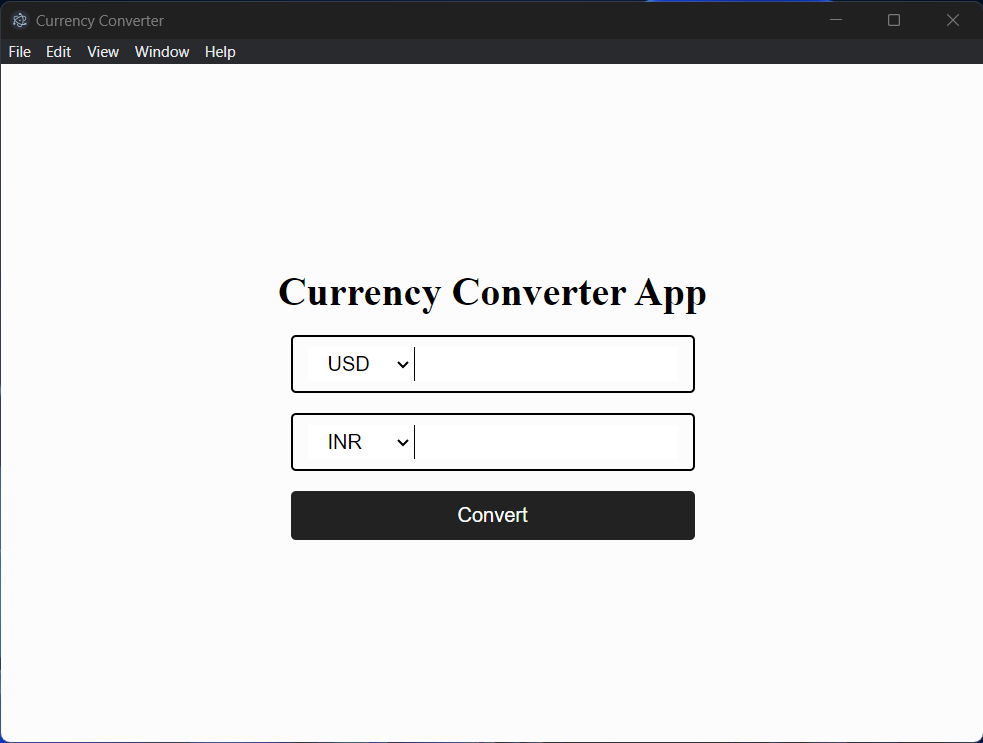

# Currency Converter App

Desktop Application built-in Electron.js for converting one currency to another

## Image



more images [here](./images)

## Setup

- `git clone https://github.com/Saurabh600/currency-converter`
- `yarn install`
- make a .env file

```sh
# development|production
APP_MODE=development

# API URL
CURRENCY_API_URL=
```

- run `yarn start`

# How to Use

- **From:** Choose any currency format from top box
- enter the amount
- **To:** choose any currency from bottom box
- click convert button

# License

This project is licensed under the MIT License, making it open and accessible for collaboration and learning.
